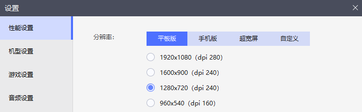

## AutoWSGR

    

用python与c++实现的战舰少女R的自动化流水线 & 数据统计一体化脚本，提供 `WSGR` 游戏级别接口以及部分图像和原子操作接口。

## 近期更新

- 自动化决战功能（目前已支持 E5 E6），使用方式见`examples/decesive_battle.py`- *2022/10/26*
- 一体化日常挂机策略，使用方式见`examples/auto_daily.py`   \- *2022/10/5*

## 功能

- 无间断重复远征
- 自动点击完成任务
- 全自动出征，可通过简单的描述文本实现高可复用的自定义策略
  - 支持：战役、演习、常规战、当前活动地图
  - 即将支持：所有类型活动图、决战
- 支持多种修理模式：快修大破、快修中破、澡堂修理（可指定船名）
- 强容错性
  - 任何游戏界面，返回主页面，处理各种特殊点击需求
  - 游戏卡死、断网时自动重启游戏、模拟器
- `ctrl+alt+c` 终止所有操作并退出程序

## 配置

### 前期准备

请自行安装 [Python](https://www.python.org/) == 3.7，[雷电模拟器](https://www.ldmnq.com/)，[战舰少女R](http://www.jianniang.com/)

推荐分辨率为 1280x720，兼容其它分辨率，高级功能的使用对分辨率有特殊要求，详见下方。



### 安装AutoWSGR

AutoWSGR 目前已支持通过 [PyPI](https://pypi.org/project/AutoWSGR/) 进行部署，您可以通过以下命令一键安装稳定发布版（推荐）：

```bash
$ pip install -U AutoWSGR
```

也可以通过以下命令从 GitHub 安装最新版：

```bash
$ pip install -U git+https://github.com/huan-yp/Auto-WSGR.git@main
```

在安装完成后，打开任意命令行并键入：

```python
import AutoWSGR
print(AutoWSGR.__version__)
```

如果没有报错则说明安装成功。

（github 上的代码并不是稳定版本，如果出现无法解决的问题请使用 pip 安装稳定发布版本）

## 快速使用

样例代码在本项目的`examples/`文件夹下，您可以参考使用。计划在未来功能更新稳定后提供全面的中文文档。

建议先尝试一体化日常挂机策略（`examples/auto_daily.py`），在使用前你需要更改如下设置：

- 将`user_settings.yaml`中的**LDPLAYER_ROOT**属性替换为您的雷电模拟器安装根目录

  ```yaml
  LDPLAYER_ROOT: C:\leidian\LDPlayer9
  ```

- 此外请确保雷电模拟器应用程序名为 `dnplayer.exe`，AutoWSGR将使用 `{LDPLAYER_ROOT}\dnplayer.exe` 命令启动模拟器。

## 启用高级功能

目前的高级功能主要指基于 `easyocr` 的，需要文字识别的功能，请按照以下说明进行配置。

**该功能要求分辨率在 `1280x720` 及以上，推荐使用 `1280x720`**

目前有以下功能属于高级功能：

- 自动化决战

### 配置 ship_name.yaml

启用基于舰船识别功能需要配置 `ship_name.yaml` 文件，该文件相对路径为 `AutoWSGR/data/ocr/ship_name.yaml`

请将同一目录下的 `shipname_example.yaml` 文件复制进去，并对照您的船舱修改对应舰船名

`shipname_example.yaml` 文件中所有舰船名和游戏图鉴保持一致，当前更新到济南版本，欢迎 PR。

如果某一舰船有多艘，请使用以下格式填写：

```yaml
No.1: # 胡德
	- 胡德荣耀
	- 胡德飙车
	- 胡德未改
```

**注意，对于名字为一个字符的舰船，例如 "鹰"(某未改潜艇)，识别效果较差，如果需要使用，请自行改为两字或以上。**

本项目通过**舰船名字**唯一区分舰船，**如果两艘舰船为同一名字（例如战列狮和战巡狮），那么她们被认为是同一艘舰船，为了避免出现不必要的麻烦，请保证需要使用到的舰船没有同名。**

**另外，由于 `easyocr` 工具本身可能没有收录一些中文字体, 所以无法识别部分生僻字, 经典例子是日系动物园和 "鲃鱼", 这里推荐把 "鲃鱼" 改名为 "肥鱼", 以解决相关问题, 以后会解决这个问题**

### 配置 GPU

这一步不是必要的，如果进行配置，会有一定的执行效率提升，但不会很大，不建议配置。

使用了 `easyocr` 识别舰船，请参考 `easyocr` 的 GPU 配置方式。

## 未来开发任务

任务大致按优先级排序。 
- 支持当前活动 (美食联合作战)
- 浴场修复，任务调度系统（对轮换策略的支持）
- 更完善的舰船解装逻辑。
- 舰船掉落数据统计。
- 建造，开发，强化，装备废弃等更多功能
- 船舱扫描检查。
- 舰船更换装备。
